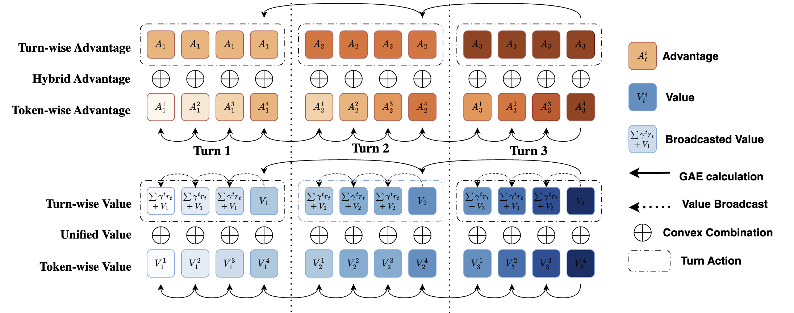
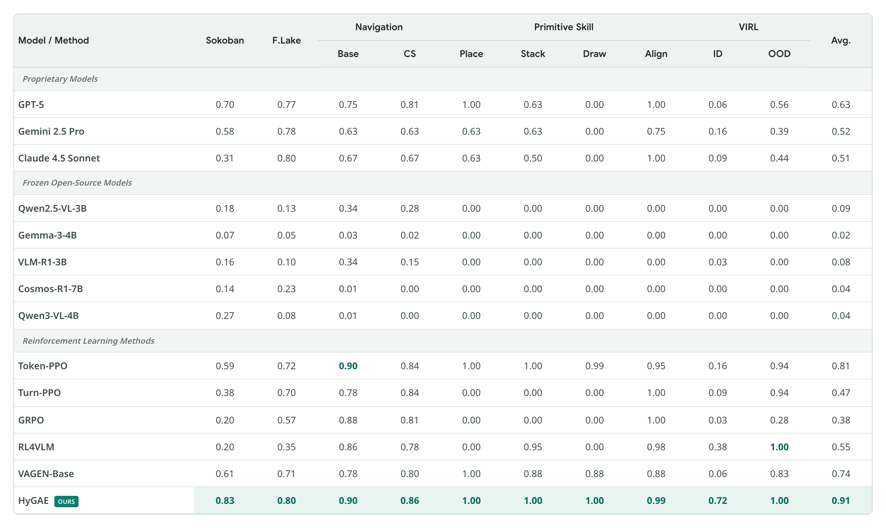
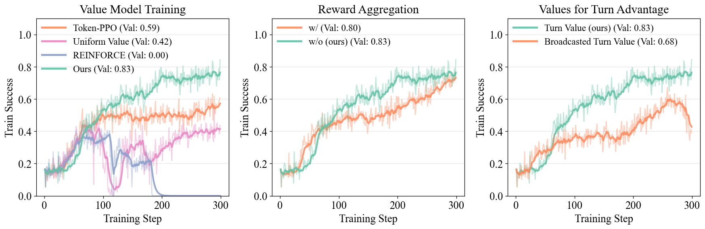

# HyGAE: Hybrid Advantage Estimation with Unified Critic for VLM Agentic Reinforcement Learning

[](https://arxiv.org/abs/2607.23605)
[](https://wx-zhang.github.io/hygae-web/)
[](https://huggingface.co/TODO)


HyGAE combines token- and turn-level advantage estimation with a unified critic for
multi-turn vision-language agent reinforcement learning.

This repository provides the official training code, rollout pipeline, scripts, and
configs for our **ECCV 2026** paper, with recipes for HyGAE, PPO, GRPO, and RL4VLM.

## 🔬 Method Overview

<p align="center">
  
</p>

**Hybrid advantage.** HyGAE computes token- and turn-wise GAE and combines the two
advantages at every token to jointly optimize both objectives.

**Unified critic.** A single critic estimates values at both scales. Turn-end values
are broadcast across action tokens and combined with token-wise values to form the
hybrid return target.

## 🚀 Performance

### Benchmark Performance

<p align="center">
  
</p>

HyGAE achieves a **91% average success rate** across five interactive environments,
outperforming Token-PPO by **10 percentage points**. The overall average weights all
ten task columns equally.

### Training Analysis

<p align="center">
  
</p>

Ablations examine the effects of hybrid return targets, reward aggregation, and
value selection on training.

## Repository layout

```text
hygae/
├── dataset/                 # RL dataset loading and collation
├── env/                     # Sokoban, FrozenLake, Navigation, Primitive Skill, VIRL
├── inference/               # OpenAI-compatible API evaluator
├── rollout/qwen_rollout/    # multi-turn VLM rollout manager
└── trainer/                 # trainer, configuration, and advantage estimators
configs/                     # environment dataset-generation configs
data/sokoban/                # fixed train/test data used by the reference run
examples/                    # environment and baseline training recipes
installation/                # pinned dependencies, VERL preparation, and preflight
scripts/train.sh             # reference training entry point and GPU controls
```

## Installation

The dependency versions are pinned from the successfully reproduced
training environment: PyTorch 2.6.0, Transformers 4.49.0, vLLM 0.8.2, and
FlashAttention 2.7.4.post1.

Following the upstream project's installation style, create a clean Conda environment and
then run the repository installer:

```bash
git clone https://github.com/wx-zhang/HYGAE.git
cd HYGAE

conda env create -f environment.yml
conda activate hygae
bash installation/install.sh
```

The installer performs four reproducible steps:

1. installs the exact versions in `installation/requirements.txt`;
2. checks out official VERL commit `329dcfe1` under `third_party/verl`;
3. verifies and applies `installation/verl.patch` idempotently;
4. installs VERL and HYGAE editable, then runs the preflight checks.


Install optional environment dependencies when needed:

```bash
# AI2-THOR Navigation
bash installation/install.sh --with-navigation

# Primitive Skill / ManiSkill
bash installation/install.sh --with-primitive-skill

# Both optional environments
bash installation/install.sh --all-envs
```

The installer is safe to run again. Verify an existing installation with:

```bash
PYTHONNOUSERSITE=1 PYTHONPATH="$PWD/third_party/verl:$PWD" \
  python installation/preflight.py
```


## Quick start

Log in to Weights & Biases if you want online experiment tracking:

```bash
wandb login
```

Run  Sokoban HYGAE recipe:

```bash
conda activate hygae
bash examples/sokoban.sh
```

The default model is `Qwen/Qwen2.5-VL-3B-Instruct`. Checkpoints are saved every 50 steps
to `checkpoints/hygae/sokoban`, and incomplete runs resume automatically from the latest
complete checkpoint. Disable or select resume with a Hydra override:

```bash
bash examples/sokoban.sh trainer.resume_mode=disable
bash examples/sokoban.sh trainer.resume_mode=/path/to/global_step_100
```

Any argument after an example script is forwarded to Hydra. For example:

```bash
bash examples/sokoban.sh \
  actor_rollout_ref.model.path=/path/to/model \
  critic.model.path=/path/to/model \
  trainer.total_training_steps=10
```
### Reproducibility and performance notes

- The reference seed is `42`; the training script fixes Python hashing and the dataset
  order.
- The critic value head uses deterministic `Normal(0, 0.002)` initialization from the
  bundled VERL patch. Changes to the critic initialization could improve performance.
- `data/sokoban/train.parquet` and `data/sokoban/test.parquet` contain the fixed seed order
  used by the released recipe.


### GPU and batch-size controls

Edit the clearly marked block at the top of `scripts/train.sh`:

```bash
NUM_GPUS_PER_NODE=4
TRAIN_BATCH_SIZE=128
PPO_MINI_BATCH_SIZE=32
MICRO_BATCH_SIZE_PER_GPU=2
```

`TRAIN_BATCH_SIZE` and `PPO_MINI_BATCH_SIZE` are global values.
`MICRO_BATCH_SIZE_PER_GPU` is shared by actor, reference policy, rollout log-prob, and
critic computation; reduce it first if training runs out of GPU memory. Advanced settings
remain in `hygae/trainer/config/trainer.yaml`.

## Other training recipes

Sokoban baselines:

```bash
bash examples/ppo.sh
bash examples/grpo.sh
bash examples/rl4vlm.sh
```

Other environments:

```bash
bash examples/frozenlake.sh
bash examples/navigation.sh
HYGAE_PRIMITIVE_RENDER_BACKEND=gpu bash examples/primitive_skill.sh
VIRL_DATA_ROOT=/path/to/SFTvsRL_Data bash examples/virl.sh
```

Only the Sokoban train/test parquet files are included. Generate another environment's
data once before training it:

```bash
python -m hygae.env.create_dataset \
  --yaml_path configs/frozenlake_env_config.yaml \
  --train_path data/frozenlake/train.parquet \
  --test_path data/frozenlake/test.parquet
```

Replace `frozenlake` and the paths with the matching environment name. Navigation requires
the optional AI2-THOR installation; Primitive Skill requires its optional packages and
assets.

### VIRL data

VIRL runs locally from the published SFTvsRL data format and does not call Google APIs.
Download the data and point `VIRL_DATA_ROOT` at the directory containing
`nyc_1k_routes/` and `VLN_mini/`:

```bash
huggingface-cli download --repo-type dataset tianzhechu/SFTvsRL_Data \
  --local-dir /path/to/SFTvsRL_Data
export VIRL_DATA_ROOT=/path/to/SFTvsRL_Data
```

See `configs/virl_env_config.yaml` for the expected paths.

## API inference

The lightweight evaluator talks to an OpenAI-compatible Chat Completions endpoint while
running the selected environment in the current process:

```bash
export OPENAI_API_KEY=your_api_key
# Optional for a compatible third-party or self-hosted endpoint:
export OPENAI_BASE_URL=https://api.example.com/v1

python -m hygae.inference.api_inference \
  --model your-model-name \
  --data data/sokoban/test.parquet \
  --output outputs/sokoban_api.jsonl
```

Use `--limit 1` for a smoke test.

## Citation

```bibtex
@inproceedings{zhang2026hygae,
  title={Hybrid Advantage Estimation with Unified Critic for VLM Agentic Reinforcement Learning},
  author={Zhang, Wenxuan and Wang, Yuhui and Jia, Donggang and Shen, Xiaoqian and Ding, Jian and Viola, Ivan and Schmidhuber, J\"urgen and Elhoseiny, Mohamed},
  booktitle={European Conference on Computer Vision (ECCV)},
  year={2026}
}
```


## Acknowledgements and license

HYGAE was developed from the open-source
[VAGEN](https://github.com/mll-lab-nu/VAGEN). 
This repository is released under the MIT License. See `LICENSE`.
